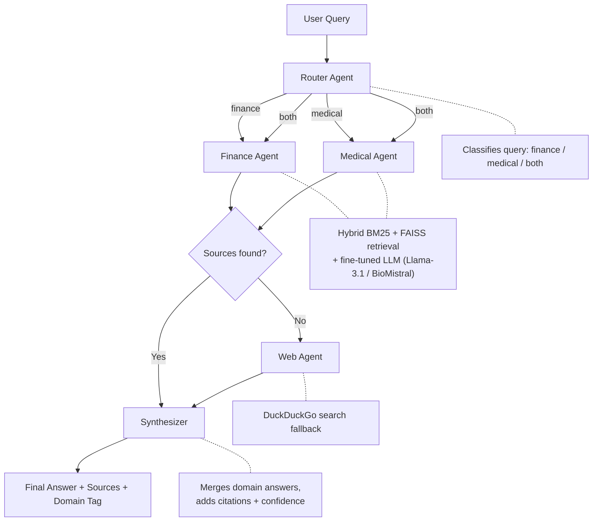

# Multi-Agent RAG

A **multi-agent Retrieval-Augmented Generation (RAG)** system for question answering across two specialized domains — **Financial** (SEC 10-K filings) and **Medical** (PubMed abstracts). Natural language queries are automatically routed to domain-specific expert agents, each backed by a fine-tuned LLM and a hybrid retriever, with a synthesizer that merges results and adds citations.

---

## Architecture



**Orchestration**: [LangGraph](https://github.com/langchain-ai/langgraph) stateful graph  
**Embeddings**: `BAAI/bge-large-en-v1.5` (Finance), `NeuML/pubmedbert-base-embeddings` (Medical)  
**Vector DB**: FAISS (local, no infra needed)  
**Retrieval**: Hybrid BM25 (40%) + Dense FAISS (60%)  
**LLM Backend**: Groq API (default) or local Ollama (fine-tuned models)

---

## Project Structure

```
DocRag/
├── app/
│   └── streamlit_app.py          # Streamlit web UI
├── src/
│   ├── agents/
│   │   ├── router.py             # Domain classifier
│   │   ├── finance_expert.py     # Finance RAG agent
│   │   ├── medical_expert.py     # Medical RAG agent
│   │   ├── web_expert.py         # Web search fallback agent
│   │   ├── synthesizer.py        # Answer merger + citations
│   │   └── graph.py              # LangGraph workflow definition
│   ├── data_ingestion/
│   │   ├── sec_downloader.py     # Download SEC 10-K filings (EDGAR)
│   │   ├── pubmed_downloader.py  # Download PubMed abstracts (Entrez)
│   │   ├── chunker.py            # Text + table chunking
│   │   └── embedder.py           # Build FAISS indexes
│   ├── retrieval/
│   │   ├── hybrid_retriever.py   # BM25 + FAISS ensemble retriever
│   │   └── reranker.py           # Optional cross-encoder reranker
│   └── evaluation/
│       ├── run_ragas.py          # RAGAS evaluation (faithfulness, relevancy)
│       ├── ablation.py           # BM25 vs dense vs hybrid comparison
│       └── generate_qa_pairs.py  # Synthetic QA pair generation
├── data/
│   ├── processed/
│   │   ├── finance_chunks.jsonl  # Chunked SEC filing text
│   │   └── medical_chunks.jsonl  # Chunked PubMed abstracts
│   └── eval/
│       ├── finance_eval.json     # 100 QA pairs for finance eval
│       └── medical_eval.json     # 100 QA pairs for medical eval
├── indexes/
│   ├── finance_faiss/            # FAISS index (BAAI/bge-large-en-v1.5)
│   └── medical_faiss/            # FAISS index (PubMedBERT)
├── training/                     # QLoRA fine-tuning scripts (run on Colab/HPC)
│   ├── train_router.py
│   ├── train_finance.py
│   ├── train_medical.py
│   ├── data_prep.py
│   └── data/                     # SFT training data (JSONL)
├── notebooks/                    # Jupyter notebooks (exploration, fine-tuning, eval)
├── config.py                     # All hyperparams, paths, model IDs
├── build_indexes.py              # One-shot script to build FAISS indexes
├── Dockerfile
├── docker-compose.yml
├── requirements.txt
└── .env.example
```

---

## Quickstart

### 1. Prerequisites

- [Docker Desktop](https://www.docker.com/products/docker-desktop/) installed and running
- A [Groq API key](https://console.groq.com/) (free tier is sufficient)

### 2. Configure Environment

```bash
cp .env.example .env
```

Edit `.env` and fill in at minimum:

```env
GROQ_API_KEY=gsk_your_groq_key_here
LLM_BACKEND=groq
```

Optional (for LangSmith tracing):
```env
LANGCHAIN_API_KEY=ls__your_key_here
LANGCHAIN_TRACING_V2=true
LANGCHAIN_PROJECT=docsight-rag
```

### 3. Run with Docker

```bash
docker compose up -d --build
```

The UI will be available at **http://localhost:8501**

```bash
# View logs
docker compose logs -f

# Stop
docker compose down
```

---

## Running Locally (without Docker)

```bash
# Create and activate a virtual environment
python -m venv .venv
source .venv/bin/activate   # On Windows: .venv\Scripts\activate

# Install dependencies
pip install -r requirements.txt

# Run the Streamlit app
streamlit run app/streamlit_app.py
```

---

## LLM Backends

The system supports two backends, configured via `LLM_BACKEND` in `.env`:

| Backend | Description | Setup |
|---|---|---|
| `groq` | Groq API with hosted Llama-3 models | Add `GROQ_API_KEY` to `.env` |
| `ollama` | Local fine-tuned GGUF models via Ollama | Run `ollama serve` + load models |

**Groq models used:**
- Router: `llama-3.1-8b-instant`
- Finance / Medical Expert: `llama-3.3-70b-versatile`
- Synthesizer: `llama-3.3-70b-versatile`

**Ollama models (after fine-tuning):**
- `phi4-mini-router`
- `llama31-finance-expert`
- `biomistral-medical-expert`

---

## Building FAISS Indexes

The `indexes/` directory is pre-built and mounted into the Docker container. To rebuild from scratch (e.g., after adding new documents):

```bash
# Step 1: Download raw data
python -m src.data_ingestion.sec_downloader
python -m src.data_ingestion.pubmed_downloader

# Step 2: Chunk documents
python -m src.data_ingestion.chunker

# Step 3: Build FAISS indexes
python build_indexes.py
```


## Evaluation

Run RAGAS evaluation over the `data/eval/` QA pairs using a subset sample to avoid API rate limits:

```bash
python -m src.evaluation.run_ragas --sample 5
```

Run ablation (BM25 vs dense vs hybrid):

```bash
python -m src.evaluation.ablation
```

### Final Evaluation Results

The final summary table based on the results from both CSV evaluation files (`finance_ragas_results.csv` and `medical_ragas_results.csv`):

| Domain | Faithfulness | Answer Relevancy | Context Precision | Context Recall |
|---|---|---|---|---|
| Finance | 0.7500 | 0.1422 | 0.0000 | 0.0000 |
| Medical | 0.5714 | 0.0000 | 0.6667 | 0.0000 |

### Key Takeaways:
- **Finance Faithfulness (75%)**: The Finance agent does a solid job of not hallucinating; 75% of its claims are directly backed by the retrieved SEC 10-K contexts.
- **Medical Context Precision (66.7%)**: The retriever is successfully identifying highly relevant medical context and ranking it near the top when searching the PubMed FAISS database.
- **Missing / Zero Scores**: As discussed, the 0.0000 values for Relevancy and Recall are mostly due to the Groq `n=1` rate limit error causing RAGAS to fail those specific metric calculations during the run, resulting in an automatic zero.
