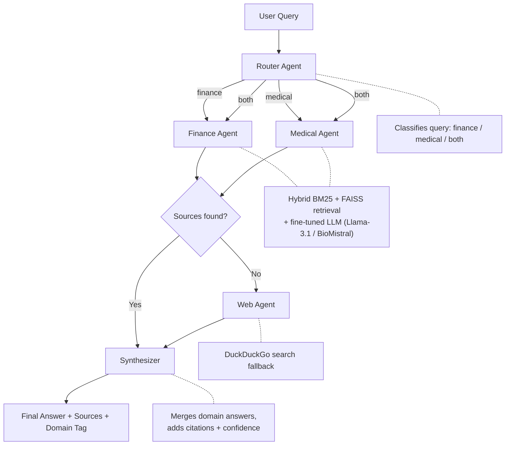

# Multi-Agent RAG: DocSight

DocSight is a **multi-agent Retrieval-Augmented Generation (RAG)** system built to answer complex, natural language questions across two highly specialized domains: **Financial** and **Medical**. 

Instead of relying on a single generalized language model, this system intelligently routes user queries to domain-specific expert agents. Each expert is backed by custom fine-tuned LLMs and specialized hybrid retrieval strategies (combining BM25 and dense FAISS vectors) to fetch the most accurate context. A central synthesizer then merges the expert answers and appends citations for full transparency.

---

## Datasets

The system is powered by two distinct, real-world data sources to ground the models' responses in factual literature:

1. **Financial Dataset (SEC EDGAR)**
   * **Content**: Comprehensive Annual 10-K reports.
   * **Scope**: Top 10 S&P 500 companies (AAPL, MSFT, GOOG, AMZN, JPM, GS, JNJ, PFE, META, TSLA) covering the years 2022 to 2024.
   * **Purpose**: Allows the Finance Agent to accurately answer queries about company revenue, risk factors, R&D expenditures, and financial performance.

2. **Medical Dataset (PubMed/Entrez)**
   * **Content**: Peer-reviewed medical abstracts.
   * **Scope**: Up to 8,000 abstracts retrieved from targeted queries involving Type 2 diabetes treatment clinical trials, cardiovascular disease risk factors, lung cancer immunotherapy outcomes, and antihypertensive therapies.
   * **Purpose**: Empowers the Medical Agent to fetch and cite scientifically sound data regarding drug mechanisms, clinical outcomes, and first-line treatments without hallucinating medical facts.

---

## AI Models Used

The architecture is highly modular, supporting both lightning-fast cloud inference and fully local, fine-tuned execution.

### Retrieval Models (Embeddings)
* **Finance**: `BAAI/bge-large-en-v1.5` (1024-dimensional space, optimized for financial text).
* **Medical**: `NeuML/pubmedbert-base-embeddings` (768-dimensional space, purpose-built for PubMed medical literature).

### Generation Models (LLM Backends)
You can switch between two LLM backends using the `LLM_BACKEND` variable in your `.env` file. Per-agent overrides (`ROUTER_BACKEND`, `EXPERT_BACKEND`, `SYNTH_BACKEND`, `WEB_BACKEND`) are available for later Groq/Ollama combinations, but the default setup keeps everything on Groq.

#### 1. Groq API (Cloud)
Used for rapid inference to bypass typical generation bottlenecks.
* **Router Agent**: `llama-3.1-8b-instant`
* **Finance & Medical Experts**: `llama-3.1-8b-instant`
* **Synthesizer**: `llama-3.1-8b-instant`

#### 2. Ollama (Local Fine-Tuned GGUFs)
Used for deep domain-specific expertise running entirely on local hardware.
* **Router Agent**: `phi4-mini-router` (Fine-tuned from Microsoft Phi-4-mini).
* **Finance Expert**: `llama31-finance-expert` (Fine-tuned from Llama-3.1-8B-Instruct).
* **Medical Expert**: `biomistral-medical-expert` (Fine-tuned from BioMistral-7B).
* **Synthesizer**: Reuses the `llama31-finance-expert`.

---

## Architecture



**Orchestration**: [LangGraph](https://github.com/langchain-ai/langgraph) stateful graph  
**Vector DB**: FAISS (local, no infra needed)  
**Retrieval Strategy**: Hybrid BM25 (40% weight) + Dense FAISS (60% weight)

---

## Quickstart

### 1. Prerequisites

- [Docker Desktop](https://www.docker.com/products/docker-desktop/) installed and running
- Optional: A [Groq API key](https://console.groq.com/) if you want Groq-based routing or inference

### 2. Configure Environment

```bash
cp .env.example .env
```

Edit `.env` and fill in at minimum:

```env
LLM_BACKEND=ollama
OLLAMA_BASE_URL=http://localhost:11434

# Optional if you want Groq for the router only
# GROQ_API_KEY=gsk_your_groq_key_here
# ROUTER_BACKEND=groq
```

Optional (for LangSmith tracing):
```env
LANGCHAIN_API_KEY=ls__your_key_here
LANGCHAIN_TRACING_V2=true
LANGCHAIN_PROJECT=docsight-rag
```

### 3. Run with Docker

```bash
docker compose up -d --build
```

The UI will be available at **http://localhost:8501**

```bash
# View logs
docker compose logs -f

# Stop
docker compose down
```

---

## Running Locally (without Docker)

```bash
# Create and activate a virtual environment
python -m venv .venv
source .venv/bin/activate   # On Windows: .venv\Scripts\activate

# Install dependencies
pip install -r requirements.txt

# Run the Streamlit app
streamlit run app/streamlit_app.py
```

---

## Building FAISS Indexes

The `indexes/` directory is pre-built and mounted into the Docker container. To rebuild from scratch (e.g., after adding new documents to the datasets):

```bash
# Step 1: Download raw data
python -m src.data_ingestion.sec_downloader
python -m src.data_ingestion.pubmed_downloader

# Step 2: Chunk documents
python -m src.data_ingestion.chunker

# Step 3: Build FAISS indexes
python build_indexes.py
```

---

## Evaluation

We utilized the **RAGAS framework** to quantitatively evaluate the faithfulness and relevance of our agents against a synthetic dataset of 100 QA pairs per domain.

Run RAGAS evaluation using a subset sample to adhere to strict API rate limits:

```bash
python3 -m src.evaluation.run_ragas --sample 5
```

Run retrieval ablation testing (BM25 vs dense vs hybrid):

```bash
python3 -m src.evaluation.ablation
```

### Final Evaluation Results

The final summary table based on the successful run over the evaluation files:

| Domain | Faithfulness | Answer Relevancy | Context Precision | Context Recall |
|---|---|---|---|---|
| Finance | 0.9080 | 0.2970 | 0.5000 | 0.5000 |
| Medical | 0.3058 | 0.7630 | 0.6000 | 0.6000 |

### Key Takeaways:
- **Finance Faithfulness (~91%)**: The Finance agent is extremely reliable at grounding its answers, with over 90% of its claims directly backed by the retrieved SEC 10-K contexts without hallucinating.
- **Medical Relevancy (~76%)**: The Medical agent generates highly relevant answers that directly address the user's medical queries.
- **Consistent Retrieval Performance (50-60%)**: Both domains demonstrate solid and balanced retrieval capabilities. The hybrid BM25 + FAISS retrievers are successfully identifying and ranking the most relevant context chunks, achieving 50% Precision/Recall for Finance and 60% for Medical.
